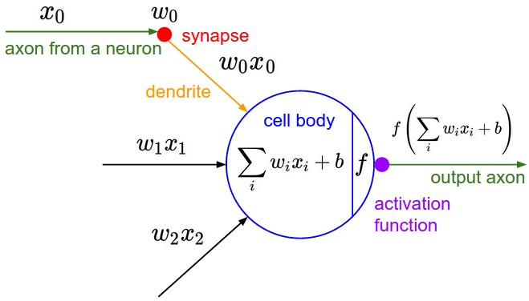

# darggrad

Autograd engine made in a day.

Supported operations: sum, negate, multiply, divide, power, and ReLu (squash at
less than zero).

Works on scalar values only.

## Notes

### Backpropagation

An algorithm that evaluates gradient of the loss function with respect to the
neural network's weights. Allows you to minimize loss function by iteratively
tune the weights, improving accuracy of network.

Originated in 1964, it doesn't involve neural network, but happens to be useful
so people use it for training NNs.

In the context of neural networks, backprop is only meaningful when training
using loss (i.e., gradient descent technically). There are many other training
methods that don't rely on loss function, and thus backprop.

#### How it works

Backprop works in 2 phases:

1. The forward pass: traces the operations performed on the tensors and
   constructs a computational DAG
1. The backward pass: traverses the DAG from the output node to the input nodes,
   recursively applying the chain rule to compute gradients.

This information is crucial as it allows us to see how much the inputs are
affecting the outputs:

$$
a = Value(1)\\
b = Value(2)\\
a + b = c\\
c.value == 3\\
c.backward()\\
a.grad = \frac{dc}{da} = ...\\
b.grad = \frac{db}{da} = ...\\
$$

Backprop starts by seeding the output node's gradient to 1.0, then build out the
computation graph in topological order, and then applying the chain rule to
compute gradients for each node. The topo sort is important because it ensures
that when we compute the gradient for a node, all of its children have already
been computed.

#### The chain rule

[Wikipedia](https://en.wikipedia.org/wiki/Chain_rule)

#### Tensors

Biggy arrays of scalars, packed together for efficiency when training on GPUs.
Not useful for demonstrating backprop, so we only support scalars in darggrad.

#### Neurons

The dot product reveals how much two vectors point in the same direction. If the
dot product is zero, the vectors are perpendicular.

Multiple dot products (converting vector x vector to a scalar value) of inputs
and weights (synaptic strengths of the input path) go into the weighted sum,
offset by a bias ("trigger happiness" of a neuron), and put through an
activation function. The activation function is typically a squashing function
that limits the output to a certain range, such as between 0 and 1 (sigmoid) or
between -1 and 1 (tanh). This helps to introduce non-linearity into the model,
allowing it to learn more complex patterns. The loss function measures how far
the neuron's output is from the desired output and is applied to the output
during training.

In a neural network, there are many neurons like so organized in layers.

When applied to the context of backprop, we are most interested in how the loss
is affected by the neuron's weights.

#### Design decision tidbits

Why wrap `Value` in shared and mutable smart pointer.

Choosing between `Box`, `Arc`, `Rc`, `Cell`, `RefCell`, `Mutex`.

[Choosing between `Box`, `Arc`, `Rc`, `Cell`, `RefCell`, `Mutex`](media/box-arc-rc-cell-refcell-mutex.png)
